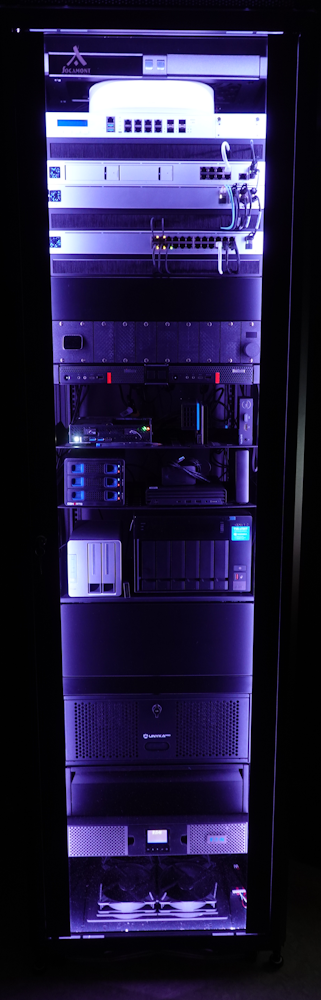

<table>
  <tr>
    <td width="40%" valign="top">
      
    </td>
    <td width="60%" valign="top">

# PricelessToolkit HomeLab

Welcome to my **HomeLab** repository.

This repo documents my Homelab / Smart Home setup, including hardware, rack layout, networking, services, automation, and configuration notes.

[Shop](https://www.pricelesstoolkit.com) | [YouTube](https://www.youtube.com/watch?v=mJt_VbMeRAU)

  

## About

- Rack overview
- Network setup
- Server hardware
- Docker / virtualization
- Monitoring
- Self-hosted services
- Backup strategy

## Goals

- Keep documentation of my setup
- Share useful configs and projects

    </td>
  </tr>
</table>
