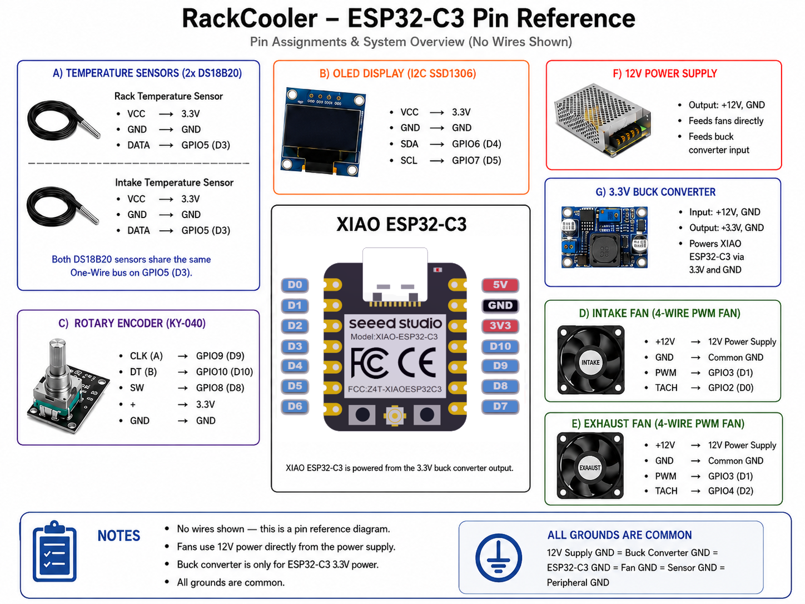

# PricelessToolkit RackCooler

RackCooler is an ESPHome-based smart cooling controller for a HomeLab or server rack. It runs on an ESP32-C3, reads rack and intake temperatures with DS18B20 sensors, drives one or more 4-wire PWM fans with PID control, monitors fan RPM, and exposes the whole setup to Home Assistant.

The controller is designed to keep the rack near a configurable target temperature while still giving you local feedback and manual control from the device itself. A small SSD1306 OLED shows intake temperature, rack temperature, target temperature, PWM output, and fan RPM. A KY-040 rotary encoder adjusts the thermostat target temperature without opening Home Assistant.

## What It Does

- Controls rack cooling fans from an ESPHome PID climate entity.
- Uses the rack temperature sensor as the thermostat input.
- Measures both rack and intake temperature with Dallas/DS18B20 sensors.
- Outputs 25 kHz PWM on a shared fan PWM line.
- Keeps enabled fans at a minimum 20% PWM so they do not stall at low demand.
- Tracks intake and exhaust fan tach signals as RPM sensors.
- Adds Home Assistant controls for fan power, OLED power, PID tuning, and deadband tuning.
- Shows live temperatures, fan speed, target temperature, and RPM on a 128x64 I2C OLED.
- Turns the OLED back on when the encoder is used, then automatically turns it off after 30 minutes.
- Publishes Wi-Fi signal, IP address, and human-readable uptime diagnostics.

## Hardware

The configuration in [`rockcooling.yaml`](rockcooling.yaml) targets an `esp32-c3-devkitm-1` board using ESP-IDF.

| Function | GPIO | Notes |
| --- | --- | --- |
| DS18B20 one-wire bus | GPIO5 | Rack and intake temperature sensors |
| OLED SDA | GPIO6 | I2C SSD1306 display |
| OLED SCL | GPIO7 | I2C SSD1306 display |
| Fan PWM output | GPIO3 | 25 kHz LEDC PWM, shared by the fans |
| Intake fan tach | GPIO2 | Pulse counter input with pull-up |
| Exhaust fan tach | GPIO4 | Pulse counter input with pull-up |
| Rotary encoder CLK | GPIO9 | Target temperature up/down |
| Rotary encoder DT | GPIO10 | Target temperature up/down |
| Rotary encoder switch | GPIO8 | Resets encoder value |

## Home Assistant Entities

ESPHome exposes the device as `RackCooler` with a PID climate controller named `RackCooler Thermostat`. The default target temperature is `30 °C`, and the visual range is `20-50 °C`.

Main entities include:

- `Rack Temperature`
- `Intake Temperature`
- `RackCooler Intake Fan RPM`
- `RackCooler Exhaust Fan RPM`
- `Fan Speed (PWM %)`
- `RackCooler Thermostat`
- `Fans Power`
- `OLED Display`
- `RackCooler WiFi Strength`
- `RackCooler IP Address`
- `RackCooler Uptime`

Tuning entities are also exposed for PID and deadband adjustment:

- `PID kp`
- `PID ki`
- `PID kd`
- `Dband Low`
- `Dband High`
- `Dband ki Multiplier`

## Cooling Behavior

When `Fans Power` is enabled, the PID controller calculates cooling demand from the rack temperature. The template output clamps that demand to a minimum of 20% PWM and a maximum of 100% PWM. When `Fans Power` is disabled, the PWM output is forced to 0% and the reported PWM sensor is updated to match.

The fan tach sensors assume two pulses per revolution, so ESPHome's pulses-per-minute reading is multiplied by `0.5` to report RPM.

## OLED Display

The OLED is split into intake and exhaust/rack sections:

- Intake side: intake temperature, PWM percentage, intake RPM.
- Exhaust side: rack temperature, target temperature, exhaust RPM.

The display can be toggled from Home Assistant with `OLED Display`. Turning the rotary encoder wakes it and restarts the 30-minute auto-off timer.

## Setup Notes

Before flashing, update these values in `rockcooling.yaml`:

- Replace `YourAPIKey` with your ESPHome API encryption key.
- Replace the OTA password placeholder.
- Confirm the fallback hotspot password is what you want.
- Make sure `wifi_ssid` and `wifi_password` exist in your ESPHome secrets.
- Update the DS18B20 addresses if your sensors are different.

Then flash it with ESPHome in the usual way:

After adoption in Home Assistant, tune the PID values from the exposed number entities while watching rack temperature, PWM percentage, and fan RPM.
